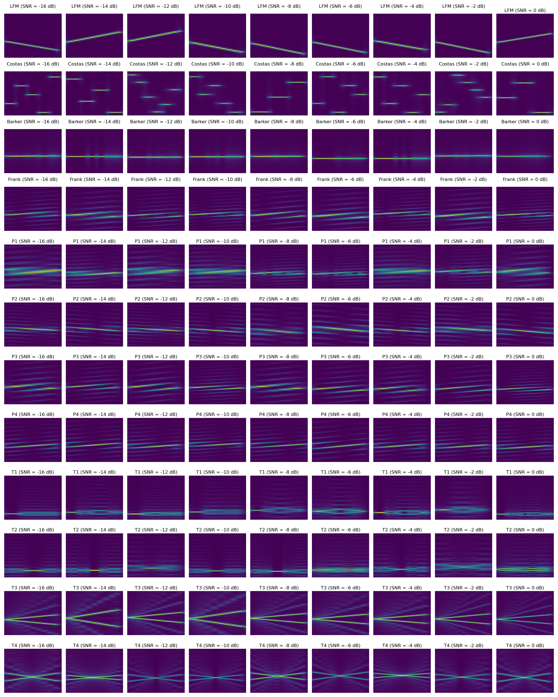
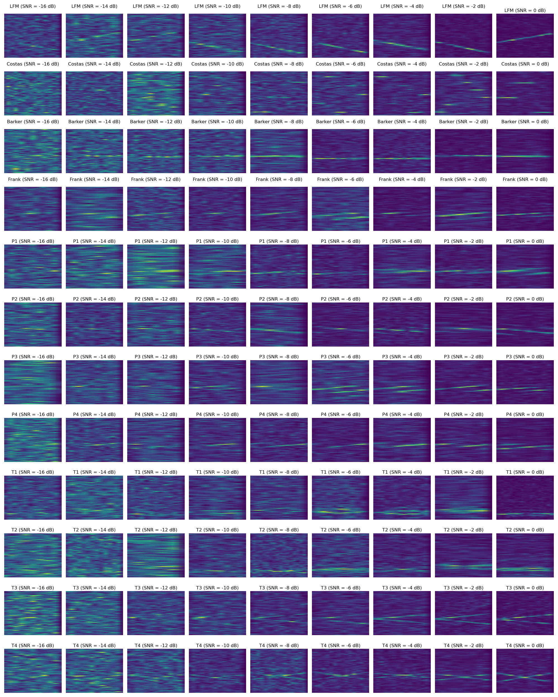
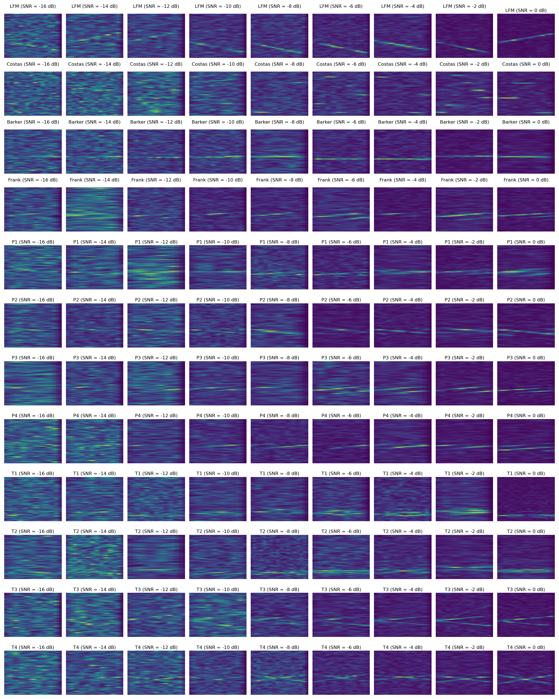

# LPI-Radar-Generator

This project generates LPI Radar Time-Series Signals based on modifications to the [LPI-Radar-Waveform-Recognition](https://github.com/vannguyentoan/LPI-Radar-Waveform-Recognition) repository. This version uses MATLAB-CWD-based code to create LPI radar signals in time-series format with various SNR conditions, and then stores them as complex I/Q data in Numpy format. The generated data can be visually confirmed using the STFT waveform.

## Overview

The generated dataset provides complex I/Q time-series data for different LPI radar waveforms under various signal-to-noise ratio (SNR) conditions. After creating the signals, STFT visualizations enable verification of the generated signals.

## Key Parameters

The following parameters are used to configure the signal generation process:

- **A**: Amplitude of the signal, set to 1
- **fps**: Frames per second, set to 1
- **fs**: Sampling frequency, set to 100 MHz
- **datatype**: Signal type, supporting various options: Original Signal, AWGN Noise, Original Signal + AWGN (Noisy), and Power Normalized Noisy Signal
- **snr_values**: Range of SNR values in dB, spanning from -16 to 2 with a step of 2
- **data_path**: Directory path to save generated data, default is `'/data/kiwan/LPI_KIWAN'`
- **waveforms**: List of radar waveform types, including 'LFM', 'Costas', 'Barker', 'Frank', 'P1', 'P2', 'P3', 'P4', 'T1', 'T2', 'T3', 'T4'

## Waveform Types

The following LPI radar waveform types are supported:
- **LFM** (Linear Frequency Modulation)
- **Costas**
- **Barker**
- **Frank**
- **P1, P2, P3, P4** (Polyphase Codes)
- **T1, T2, T3, T4** (Various pulse-based codes)

## Data Structure and Storage

The generated data for each waveform is saved as complex I/Q data in Numpy `.npy` format, with the following structure:

1. **Original Signal**: Clean signal without noise.
2. **AWGN Noise**: Additive White Gaussian Noise generated separately.
3. **Noisy Signal**: Original signal combined with AWGN.
4. **Power Normalized Noisy Signal**: Noisy signal that undergoes power normalization.

## STFT Visualization for Verification

To verify the signal generation process, Short-Time Fourier Transform (STFT) images are provided for each signal type.

### Original Signal - STFT

The STFT visualization of the original clean signal:

### Noisy Signal - STFT

The STFT visualization of the original signal combined with AWGN noise:

### Power Normalized Noisy Signal - STFT

The STFT visualization of the power normalized noisy signal:

## How to Use

1. **Set Parameters**: Modify the key parameters in the script to fit your requirements.
2. **Generate Data**: Run the script to generate the radar signal data in the chosen directory.
3. **Verify Data**: Use the STFT visualizations to verify that the signals are generated correctly, especially under low SNR conditions.

--- 

This README layout provides a clear structure, making it easier to understand the data generation process, parameters, and verification steps.