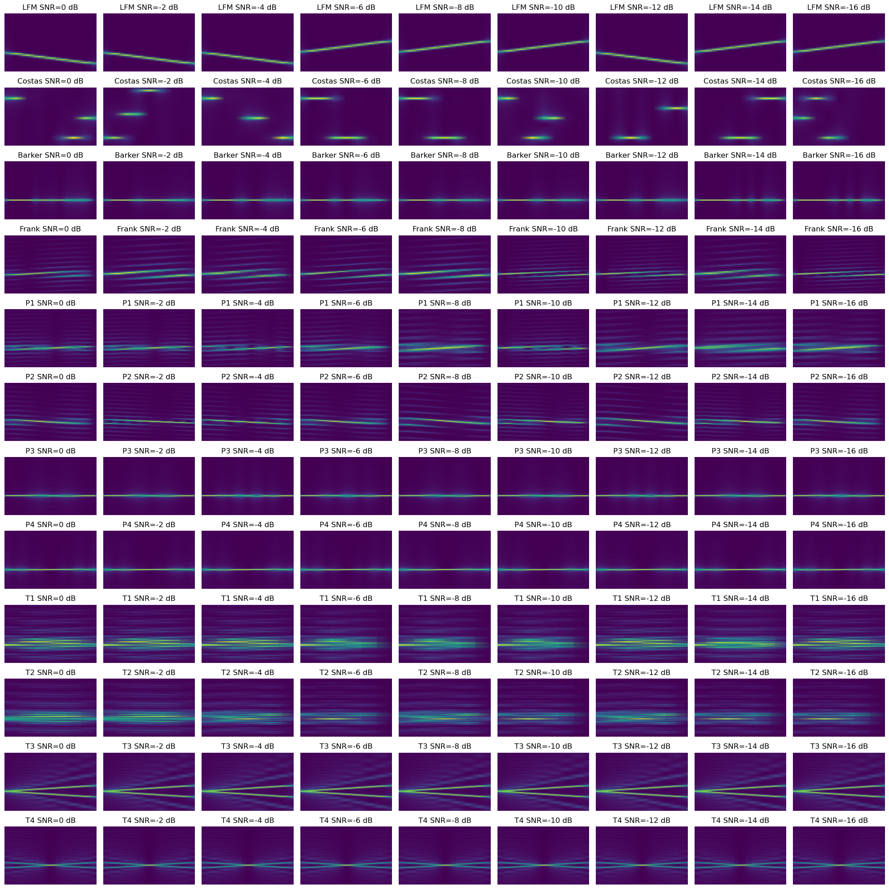

# LPI-Radar-Generator

본 디렉터리는 [LPI-Radar-Waveform-Recognition](https://github.com/vannguyentoan/LPI-Radar-Waveform-Recognition)을 참고하여 파이썬 코드로 작성한 공간입니다.

한 클래스의 SNR 당 생성되는 데이터 개수를 많이 생성하고 싶으면, 'fps' 변수를 쓰세요.
그 외 기본적으로 파일이 저장되는 디렉터리 위치는 제가 사용하던 경로로 지정되어 있습니다.

# Power Norm(Original Signals) + AWGN + MultiPath-processing

# Original Signals + AWGN + MultiPath-processing

# Original Signals

